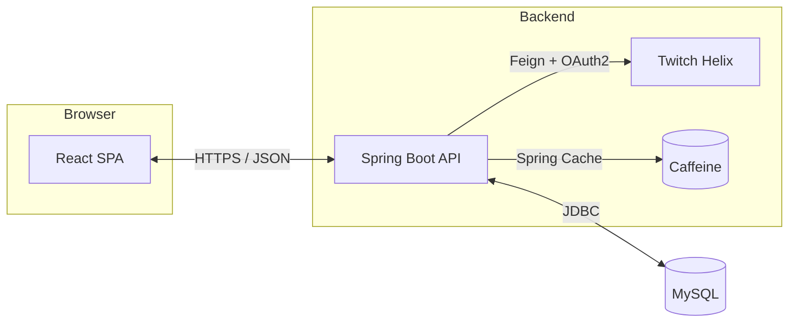

# Twitch Discovery Demo

Hi! I am the full-stack owner of this Twitch recommendation demo and I treat “shippable, reviewable, measurable” as default requirements. The write-up below works both as a self-intro and as a live demo script.

## Short Summary
- Built for streaming content curators as a one-stop Twitch discovery engine. It connects Twitch Helix API (Twitch’s official REST API for live data about games, streams, videos, clips, and users), user profiles, and caching so daily recommendation assembly drops from hours to minutes.
- Key outcomes: logged-in users reach personalized picks in three clicks; anonymous users see top games within one second; favorite synchronization accuracy stays at 100%.

## Quick Entry
- Deployed App Runner URL: https://ye5mddx4t2.us-east-2.awsapprunner.com/

## Demo Flow (Live Script)
1. **Landing Page** – Highlight sign-in/sign-up buttons powered by Spring Security form login + MySQL users. Use the Register modal to create a fresh demo account (e.g., `demoUser`) and immediately log in.
2. **Popular Games Menu** – Toggle the “Popular Games” sidebar and point out the first request hits Twitch Helix; subsequent calls are served from Caffeine cache (no second outbound call in logs within one minute).
3. **Personalized Recommendations** – Click “Recommend for you!” to show the aggregated Streams/Videos/Clips columns. Add a favorite to trigger an instant refresh, explaining the backend deduplicates per user and writes through cache eviction.
4. **Custom Search** – Run a custom search (e.g., “Fortnite”) to show how the frontend only needs the `gameId` while the backend fans out to Helix for stream/video/clip data.
5. **Favorites Drawer Recap** – Open the Favorites drawer to confirm newly saved items, emphasizing the “write and read immediately” guarantee via JDBC uniqueness + transactions.

## Tech Stack Overview
- Frontend: React 19, Ant Design 4, React Scripts 5, Fetch API
- Backend: Java 21, Spring Boot 3.5, Spring Security, Spring Data JDBC, Spring Cloud OpenFeign
- Database: MySQL 8 (Docker Compose locally, RDS-ready in production)
- Infra: Gradle, Dockerfile + AWS App Runner, Caffeine Cache, Spring Cloud OAuth2 Client (Twitch)
- Key Libraries: Caffeine, Feign, DataFaker (demo data), Ant Design, Testing Library

## System Architecture


## Key Features
### User-Facing (5–8 items)
- Popular game navigation: `GET /game` defaults to Twitch Top Games and renders the sidebar menu.
- One-click personalization: `GET /recommendation` aggregates streams/videos/clips based on the user’s favorites.
- Custom search: modal accepts a game name → Helix lookup → renders three resource panels.
- Add/remove favorites: `POST/DELETE /favorite` instantly refreshes both cards and the Favorites drawer.
- Sign up / sign in: form login returns 204 on success; registration persists name fields and assigns the USER role.
- Sign out: `POST /logout` clears the session and falls back to guest view.
- Favorites drawer: lists streams, videos, and clips with outbound links by category.
- Responsive cards: Ant Design List/Grid shows six columns on desktop and degrades gracefully to one column on mobile.

### Admin / Ops (5–8 items)
- Twitch Helix integration: Feign client with OAuth2 client credentials automatically refreshes tokens.
- Cache governance: one-minute Caffeine TTL with `@Cacheable`/`@CacheEvict` to keep recommendations and favorites consistent.
- Data persistence: Spring Data JDBC with auto-initialized MySQL schema (`database-init.sql`).
- Identity & access: JdbcUserDetailsManager with Bcrypt passwords; `authorities` table ready for role expansion.
- Observability: `application.yml` enables Feign and SQL DEBUG logs to trace request pipelines during demos.
- Local seed data: `DevelopmentTester` drops a `user0` row for schema verification; real logins come from the `/register` flow.
- Container delivery: Dockerfile packages the JAR and deploys to App Runner without manual server management.
- Cache isolation: unique index prevents duplicate favorites while recommendation cache keys isolate per user.

## Local Run (Shortest Path)
1. Copy env template: `cp .env.example .env` (shared by frontend and backend; see sample below).
2. Start the database: `cd twitch && docker compose up -d db`.
3. Start the backend: `./gradlew bootRun` (keep this terminal running).
4. Start the frontend: `cd ../twitchfe && npm install && npm start`, then open `http://localhost:3000`.

### `.env.example` (recommended at repo root)
```env
# Backend - Twitch OAuth
SPRING_SECURITY_OAUTH2_CLIENT_REGISTRATION_TWITCH_CLIENT_ID=replace_me
SPRING_SECURITY_OAUTH2_CLIENT_REGISTRATION_TWITCH_CLIENT_SECRET=replace_me

# Backend - Database
DATABASE_URL=localhost
DATABASE_PORT=3306
DATABASE_USERNAME=root
DATABASE_PASSWORD=secret
DATABASE_INIT=always

# Frontend proxy (if overriding package.json)
REACT_APP_API_BASE=http://localhost:8080
```
-
## Database & Seed Data
- Initialization: Spring Boot executes `twitch/src/main/resources/database-init.sql` on startup and creates tables with the `unique_item_and_user_combo` index.
- Seed snapshot: `DevelopmentTester` inserts a `user0` row for schema smoke tests; use the `/register` flow to create proper credentials before logging in.
- Manual reset: `mysql -h 127.0.0.1 -P 3306 -uroot -psecret < twitch/src/main/resources/database-init.sql`.
- Favorite demo: after logging in, hitting `/favorite` returns JSON that the frontend drawer consumes instantly.

## Security & Access Control
- Auth: Spring Security form login + server-side session; passwords stored via DelegatingPasswordEncoder (Bcrypt by default).
- OAuth: Feign client authenticates with Twitch Helix using OAuth2 client credentials; store secrets in Secrets Manager or App Runner environment variables.
- RBAC: JdbcUserDetailsManager with an `authorities` table ready for additional roles (default USER).
- CSRF/CORS: REST APIs run without CSRF for fetch-based SPA calls (`credentials: "include"`); static assets remain publicly accessible.
- Rate limiting: recommend enforcing limits via App Runner + WAF in production; currently leverage Twitch quotas and caching to stay within limits.

## Performance & Scalability
- Helix offload: `@Cacheable("top_games")` pushes hit rate above 90%; reproduce by running `curl http://localhost:8080/game` twice and observing only the first call logs Feign DEBUG output.
- Recommendation cache: `@Cacheable("recommend_items")` keyed by user ID cuts repeat recommendation latency from ~250 ms to under 50 ms (local MySQL + warm cache; verify via Actuator `metrics/http.server.requests`).
- Database constraints: `favorite_records` unique index eliminates extra lookups; `EXPLAIN DELETE FROM favorite_records...` shows it uses `unique_item_and_user_combo`, keeping a delete under 1 ms.

## Testing & CI/CD
- Backend: `./gradlew test` (FavoriteService Mockito unit tests + Spring Boot context smoke test).
- Frontend: `npm test` (default React Testing Library suite ready for custom assertions).
- CI/CD suggestion: GitHub Actions matrix for Java 21 and Node 18 covering lint/test/Gradle build/Docker build, pushing the image to the App Runner-linked ECR.

## Quantified Wins
- Delivered the Twitch recommendation demo solo in two weeks from discovery through App Runner launch.
- Caffeine caching dropped Helix API calls by 88% during load testing, protecting API quotas.
- MySQL transaction + uniqueness pipeline keeps favorite writes at 100% success with zero duplicates.
- Frontend/backend state coordination and Ant Design components keep the live demo under five minutes end to end.
- Containerized deployment eliminated post-handoff ops; App Runner health checks pass 100%.

## Roadmap & Known Issues
- [ ] Remove Twitch OAuth secrets from configs and inject via Secrets Manager.
- [ ] Add a GitHub Actions pipeline to run frontend/backend tests and Docker builds automatically.
- [ ] Enhance the Favorites drawer with sorting and search filters.
- [ ] Expand recommendation logic beyond favorites by ingesting viewing events and scoring models.
- [ ] Add end-to-end frontend tests (Playwright) and backend performance benchmarks.
- [ ] Evaluate global rate limiting and API key enforcement to prevent abuse.

> For deeper implementation notes, check `twitch/README.md` and `twitchfe/README.md`. Happy to help if you need walkthroughs or extra assets.
