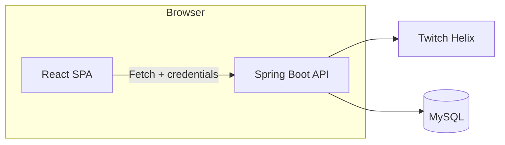

# Twitch Recommendation Frontend

React single-page application that surfaces Twitch game discovery, personalized recommendations, and favorite management in sync with the Spring Boot backend.

## Summary
- Presents top games, personalized streams/videos/clips, and searchable results with Ant Design components.
- Handles login, registration, favorites, and recommendations through the backend proxy (`proxy` to `http://localhost:8080`).
- Designed for fast demo flow: modals for auth/search, responsive grid layout for media cards, and a drawer for saved favorites.

## Architecture


## Key Technologies
- React 19 with functional components and hooks
- Ant Design 4 UI library and icon set
- Fetch API for JSON requests with session credentials
- React Scripts 5 (Create React App) build pipeline
- Testing Library + Jest setup via CRA

## App Structure
- `src/App.js` – Global layout, menu interactions, and state orchestration for auth, favorites, and resources.
- `src/utils.js` – REST helpers wrapping backend endpoints (`/login`, `/register`, `/favorite`, `/game`, `/search`, `/recommendation`).
- `src/components/`
  - `PageHeader`, `Login`, `Register` – Auth modals and header controls.
  - `CustomSearch` – Game name lookup modal.
  - `Home` – Tabbed streams/videos/clips grid with favorite toggles.
  - `Favorites` & `MenuItem` – Drawer-based favorites navigation with outbound links.
- `src/index.js` – SPA bootstrap, Ant Design stylesheet import, CRA entry point.
- `public/` – CRA static assets; production build served from the backend’s `public` directory.

## Feature Highlights
- **Instant Favorites Sync** – Favorite buttons update both the card UI and drawer via fresh `/favorite` fetches.
- **Personalized Recommendation Tab** – Pulls Caffeine-cached results tailored to logged-in users.
- **Popular Games Menu** – Displays top Twitch games with circular thumbnails pulled from Helix metadata.
- **Custom Search Flow** – Accepts game names, resolves to IDs, and renders multi-type results.
- **Responsive Layout** – Ant Design grid adapts from six columns on desktop to single-column stacks on mobile.
- **Credential-Aware Fetches** – All user actions include cookies (`credentials: "include"`) to honor Spring Security sessions.

## Local Development
1. Install dependencies: `npm install`
2. Ensure the backend is running on `http://localhost:8080` (or adjust proxy/env as below).
3. Start the dev server: `npm start` and open `http://localhost:3000`

Hot reload is enabled; API calls are automatically proxied to the backend during development.

## Environment Configuration
- CRA proxy is set in `package.json` (`"proxy": "http://localhost:8080"`).
- Optional override via `.env`:
  ```env
  REACT_APP_API_BASE=http://localhost:8080
  ```
  Update `utils.js` to respect the custom base URL if you choose to decouple from the proxy.

## Build & Deploy
- Production bundle: `npm run build` → outputs to `build/`
- To serve from the backend, copy the build output into `twitch/src/main/resources/public` (already prepared in this repo).
- For standalone hosting, deploy the `build/` directory to any static host (S3 + CloudFront, Netlify, Vercel, etc.) and point API calls to the deployed backend URL.

## Testing
- Run unit/UI tests: `npm test`
- CRA ships with Jest + Testing Library setup in `src/setupTests.js`; extend with component-specific cases as needed.

## Deployment Notes & Gotchas
- Requires the backend to expose the same-origin endpoints (`/login`, `/game`, etc.); production build assumes it’s served behind the Spring Boot app for cookie sharing.
- Ant Design stylesheet is imported globally in `src/index.js`; ensure any CSS overrides are scoped or appended after the import.
- Favorites rely on backend session cookies—when hosted separately, configure CORS + `credentials` on the backend accordingly.

## Roadmap Ideas
- Add skeleton loading states for search/recommendation results.
- Expand testing coverage with component-level assertions for `Home` and `Favorites`.
- Introduce optimistic UI for favorite toggles to reduce perceived latency.
- Support dark mode via Ant Design theming tokens.
